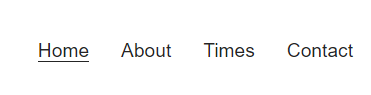

# Padel Club
 
 ## Welcome to my first Portfolio Project!

 This page for a Padel Club was an assignment for my Full Stack Developer-course on [Code Institute](hhtp://codeinstitute.net). 
 The choice for a Padel Club were actually random and the idea was to create a 'here we are, come join us'-type of page. 
 Padel has become a very popular sport in a very short time and with this page i wanted to stress that everyone can enjoy padel 
 and everyone should try it out. Users of this website is meant be inspired to seek more information and/or sign up on the contact page. 
  
 The live website can be found [here](link)
 
## Technologies Used

 For this project we were allowed to use two programming languages: 

 - [HTML5](https://sv.wikipedia.org/wiki/HTML5)
 - [CSS](https://en.wikipedia.org/wiki/CSS)

## Design

### Colour Scheme

My two main colours used are white #fff and a nuance of black #252525. The purpose behind that was to create a easy to read, stylish contrast
that makes it easy for everyone to see regardless of device. 

### Typography

The headers on all pages throughout the Website are using the Montserrat font while the main text is using the Source San Pro font.
I choose these fonts because they were a good match along with the black-on-white stylish colour scheme. 

### Imagery

Images were choosen to be inclusive and show of a varity of different people to inhance that padel is a sport for everyone. 
Size and placement may vary depeding on image and intendend devices displayed on. 

## Features

* #### Navigation
    * Positioned at top right of the page. 
    * Displays links to the About us and Times sections and to the Contact Page.
    * On the Contact Page, the nav bar got a white background to be more readable.
    
* #### Header
    * Positioned at the top left of the page.
    * Clearly states the name. 
    [Screenhot]

* #### About Us Section
    * Contains a short description about the club. Such as location and purpose. 
    * Contains a padel related image of a women and a man.
    * Contains a short list of some core values for the club.
    [Screenhot]

* #### When and Where Section
    * Referred to as "Times"-section in the navigation for user design friendlyness.
    * Contains a image of a group of kids and a textbox with some information regarding 
    what the club has to offer for kids. 
    * Contains times and information regarding times, location, courts etc.
    [Screenhot]

* #### Contact Page
    * Takes the user to a new page. 
    * Contains a form where the user can interact, filling in his/her information and choose
    how to the contacted back. 
    * Contains navigation to get back to 'main page'.
    [Screenhot]

* #### Footer
    * Contains links to Facebook, Twitter and Instagram. 
    * Since it's not a real padel club the links only takes the user to the main page of the websites mentioned above.
    * Contains a paragraf stating copyrights. 
    [Screenhot]

## Testing

* Tested on three diffrent browsers: Edge, Chrome and Firefox. 
* Checked responsiveness (using dev tools) on Desktops, Laptops, Tablets and Mobile. 
* Checked that the form works, validating it thorugh Code Institutes 'formdump' page.

### Validator Testing

* #### HTML
    * No errors or warnings returned when passing through the official W3C validator.

* #### CSS 
    * No errors or warnings returned when passing through the official (Jigsaw) validator.

* #### Lighthouse (in chrome dev tools)
    * Checked both main page and contact page used lighthouse

    2x[screenshot]

### Bugs

#### Solved bugs
* Got an 'Warning: Consider using the h1 element as a top-level heading only (all h1 elements are treated as top-level headings by many screen readers and other tools).' error when validating my HMTL. 
    * Solved it by replacing the sections for divs.

### Deployment
* The website was deployed to GitHub pages. The steps to deploy are as follows:
    * In the GitHub repository, navigate to the 'Settings' tab.
    * From the source section drop-down menu, select the 'Master Branch'.
    * Once the master branch has been selected, the page provided the link to the completed website. 

## Credits

### Content
* [The Love Running Project](https://github.com/Code-Institute-Org/love-running-2.0) from [CI](https://codeinstitute.net) in regards of both design/layout ideas as well as code. The footer and form are mainly code from the love running project. 

* All the course material from [CI's 'Full Stack Developer'](https://codeinstitute.net/se/full-stack-software-development-diploma/) curriculum leading up to this project.

* [Kevin Powell](https://www.youtube.com/kepowob) for the usage of flexbox. 

* [Stack Overflow](https://stackoverflow.com/) for various things along the project.

* [Font Awesome](https://fontawesome.com) is used for all the icons.

* [Google Fonts](https://googlefonts.com) is used for the text fonts. 

### Media
* All images are taken from [Freepik](freepik.com)
* Text from the About Us/Who are we? section are translated from [Vamos Padel Club](https://vamospadelclub.se/om-hallen-och-vamos-padel-club/)

## Acknowledgments
* **My Mentor Ronan McClelland was a invaluable help on the way with tips and resources to help me overcome every obsticle i faced. Can't thank him enough.**

